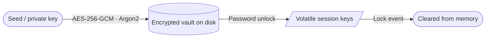
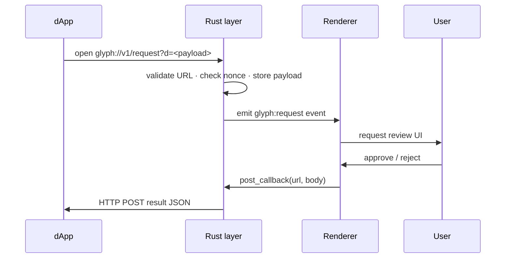

<div align="center">


# Glyph

**Self-custodial Qubic desktop wallet**

[](https://github.com/glyph-ecosystem/wallet/releases/latest)
[](https://github.com/glyph-ecosystem/wallet/actions)
[](./LICENSE)
[](https://discord.gg/s5qNRNGu96)

Windows · macOS (Universal) · Linux (AppImage · .deb · .rpm)

[**Download**](https://github.com/glyph-ecosystem/wallet/releases/latest) · [Website](https://wallet.glyphq.org) · [Discord](https://discord.gg/s5qNRNGu96)

</div>

---

Keys stay encrypted on disk. Signing material lives only in Rust process memory and is wiped immediately on lock. No Glyph backend, no key escrow, no browser extension surface.

## Features

**Wallet**
- Send, receive, burn, stake
- Send Many — up to 25 transfers in a single session with CSV/JSON import
- Full transaction history with memos and fiat price snapshots
- Vault analytics — net flow, top counterparties, monthly summaries
- Global search across accounts, contacts, tx hashes, and memos

**Security**
- AES-256-GCM encrypted vaults with Argon2 KDF
- Auto-lock on idle, sleep, or window blur
- Clipboard auto-clear; immediate wipe on lock
- Biometric unlock — Windows Hello, macOS Touch ID, Linux secret store
- Local audit log of every signing event
- Signed update payload verification

**dApp integration**
- Native `glyph://` deep-link protocol
- Request types: `transfer`, `sc_call`, `sign_message`, `verify_message`, `connect`
- Replay protection via nonce store (1-hour window)
- Result delivery via server callback POST or browser redirect
- Request history with per-entry callback status

**Desktop**
- System tray with hide-to-tray
- Desktop notifications with inbox, per-type filters, and price/balance alerts
- Multiple vaults with color coding, watch-only support
- Themes, font pairs, accent colors

**Design**
- Comprehensive design system (`DESIGN.md`) — colors, typography, spacing, components
- Sheet-based dialogs throughout (bottom-slide pattern)
- Geist font family (sans, display, mono)
- Phantom-inspired dark UI with floating navigation
- Bottom nav auto-hides when sheets are open

## Security Model

Vault data is encrypted before hitting disk. Unlocked keys never leave the Rust process.



Sensitive operations are isolated to the Rust layer — the renderer only sends signing requests and receives back signed transactions.

| Operation | Layer |
|---|---|
| Vault encryption / decryption | Rust (`aes-gcm`) |
| Deep-link URL validation | Rust |
| Nonce replay protection | Rust |
| Callback HTTP posting | Rust (`reqwest`) |
| Auto-lock timer | Rust (background thread) |
| Clipboard clear | Rust |
| Update payload verification | Rust |

## Deep-Link Protocol

dApps send requests by opening a `glyph://v1/request?d=<base64url-envelope>` URL. Glyph validates, queues, and presents a review screen. Results are delivered to the dApp via callback POST or redirect URL.



Use [`@glyph-ecosystem/connect`](https://github.com/glyph-ecosystem/glyph.connect) to build envelopes and handle result delivery from any framework.

## Build Locally

**Requirements:** [rustup](https://rustup.rs/) · Bun 1.3.14 · platform webview/build tools

The repository pins Rust 1.88.0. The pin is honored only when `cargo` and `rustc`
come from rustup (`~/.cargo/bin`), not from an older distribution package.

Ubuntu/Debian developers need only the native headers used by this project:

```sh
sudo apt update
sudo apt install build-essential libwebkit2gtk-4.1-dev libdbus-1-dev
```

Building Debian, RPM, or AppImage release artifacts additionally requires
`libayatana-appindicator3-dev`, `librsvg2-dev`, `patchelf`, `rpm`, and
`xdg-utils`. The appindicator and librsvg headers are not needed by Glyph's
Cargo feature graph, but Tauri's Linux bundler and GTK AppImage plugin consume
their `pkg-config` metadata. The AppImage bundler also invokes `xdg-mime` from
`xdg-utils`. `libssl-dev` and `libxdo-dev` are not required.

The release workflow builds AppImage first, then deb/rpm with
`configs/tauri-linux-packages.json`. It clears Tauri's generated AppDir before
the AppImage build together with the intermediate `appimage_deb` staging tree.
This prevents package-only file maps from leaking into the AppImage.
The canonical patcher then installs AppStream metadata into the final AppImage
before validation.

```sh
git clone https://github.com/glyph-ecosystem/wallet
cd wallet
bun install
bun tauri dev        # dev server
bun tauri build      # production bundle → src-tauri/target/release/bundle/
```

**Checks:**
```sh
bun run typecheck
bun run test
cargo check --manifest-path src-tauri/Cargo.toml --locked
bun run release:check
```

### Linux runtime notes

- Install `.deb` packages with `apt install ./Glyph_*.deb` so WebKitGTK, GTK,
  D-Bus, and appindicator runtime dependencies are resolved automatically.
- The AppImage bundles its WebKitGTK/GTK stack and WebKit subprocesses, while
  deliberately using the host's GL/EGL drivers for graphics compatibility.
- The main window does not depend on the system tray. On GNOME, displaying the
  tray icon may require an AppIndicator extension.
- Linux biometric unlock requires a working Secret Service provider such as
  GNOME Keyring or KWallet. Without one, Glyph continues to start, disables
  biometric availability, and uses a permission-restricted (`0600`) metadata
  key file fallback.
- WSLg is detected at startup and WebKit hardware compositing is disabled only
  in that environment to avoid blank-window EGL failures.

### Release pipeline

Changesets creates the version PR and tag, then dispatches the isolated
`Release` workflow. Platform artifacts upload to a draft release, Linux bundles
are structurally validated, updater signatures are cross-checked against their
artifacts, and the release is published only after the complete asset set and
`latest.json` pass validation. The workflow can be retried manually for an
existing tag while its release remains a draft, without moving the tag. A
published release is treated as immutable. Tauri's Linux bundler helpers and
the AppImage repacking tools are preseeded from immutable source revisions or
release asset IDs and checksum-verified, so upstream changes cannot silently
alter a release build.

Publishing requires repository secrets for the Tauri updater key
(`TAURI_SIGNING_PRIVATE_KEY`, `TAURI_SIGNING_PRIVATE_KEY_PASSWORD`), Apple code
signing and notarization (`APPLE_CERTIFICATE`, `APPLE_CERTIFICATE_PASSWORD`,
`APPLE_ID`, `APPLE_PASSWORD`, `APPLE_TEAM_ID`), and Windows Authenticode
(`WINDOWS_CERTIFICATE`, `WINDOWS_CERTIFICATE_PASSWORD`). Missing credentials,
invalid native signatures, absent timestamps/notarization tickets, or invalid
updater signatures stop the draft before publication.

## Stack

| Layer | Choice |
|---|---|
| Desktop shell | Tauri v2 |
| Frontend | React 19 + TypeScript |
| State | Zustand v5 + TanStack Query v5 |
| Animations | Motion |
| Design system | See [`DESIGN.md`](./DESIGN.md) |
| Native | Rust |
| Crypto | `aes-gcm` (Rust) |
| Qubic SDK | `@qubic-lib/{crypto,tx,rpc,contracts}` |

## Updater

| Platform | Update path |
|---|---|
| Windows | NSIS built-in updater |
| macOS | App built-in updater |
| Linux AppImage | Built-in updater |
| Linux deb / rpm | System package manager |

## Community

- **Discord:** https://discord.gg/s5qNRNGu96
- **GitHub:** https://github.com/glyph-ecosystem/wallet
- **Website:** https://wallet.glyphq.org

## License

Source-available. See repository for current terms.
