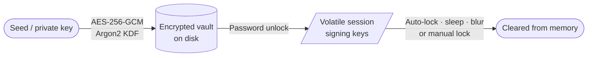
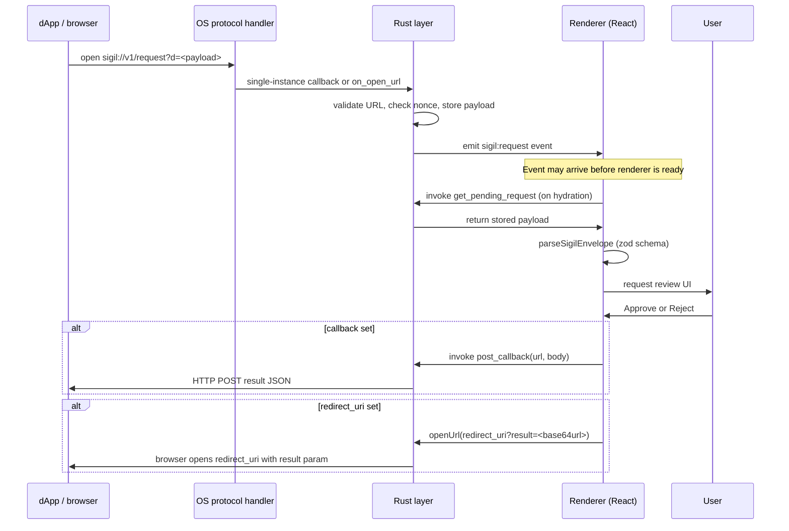
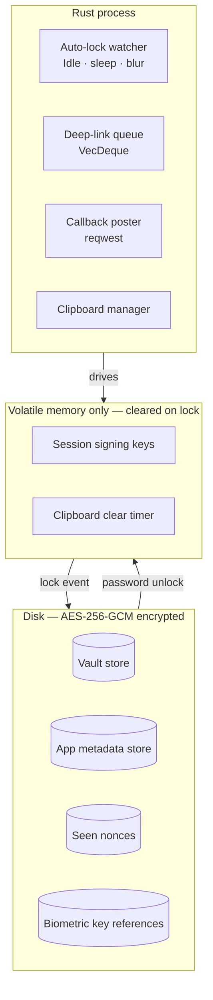

# Sigil

Self-custodial Qubic wallet for desktop. Built with Tauri v2, React 19, and Rust.

Sigil keeps keys encrypted on disk and signing material exclusively in volatile memory. No Sigil backend, no key escrow, no browser extension attack surface.

---

## Security Model

### Key storage

Vault data is encrypted with AES-256-GCM before being written to disk. The encryption key is derived from the user's password using Argon2. App metadata (settings, contacts, history) is encrypted separately using a device-local key.



Unlocked signing material is held only in the Rust process's in-memory session state. It is never written to disk, never serialized, and cleared immediately on any lock event.

### Process boundary

Sensitive operations run in the Rust native layer, not the renderer:

| Operation | Layer |
|---|---|
| Vault encryption / decryption | Rust (`aes-gcm`) |
| Deep-link URL validation | Rust |
| Nonce replay protection | Rust (persisted nonce store) |
| Callback HTTP posting | Rust (`reqwest`) |
| Redirect URI browser launch | Rust (`tauri-plugin-opener`) |
| Auto-lock timer | Rust (background thread) |
| Clipboard clear | Rust |
| Update payload verification | Rust (built-in Tauri updater key) |

The renderer never touches raw seeds or signing keys directly. It sends a signing request to the Rust layer and receives a signed transaction back.

### Threat model boundaries

- **Encrypted at rest.** Vault files are opaque ciphertext without the password.
- **No cloud custody.** Sigil never transmits keys or seeds to any server.
- **Replay protection.** Each `sigil://` deep-link carries a nonce; Sigil stores seen nonces and rejects replays for up to one hour.
- **Delivery URL validation.** Rust rejects `callback` and `redirect_uri` URLs targeting private or loopback addresses except `localhost`/`127.0.0.1` for local development.
- **Signed update payloads.** Desktop updates are verified against the embedded updater signing key before installation.

---

## Deep-Link Architecture

Sigil registers the `sigil://` protocol. dApps send requests by constructing a `sigil://v1/request?d=<base64url-envelope>` URL and opening it.

### End-to-end flow



If the app is locked when a request arrives, the request is held in the session queue. After unlock, the lock screen routes directly to the request review screen.

### Request types

| Type | Description |
|---|---|
| `transfer` | Sign a QU transfer to a specified recipient |
| `sc_call` | Sign a smart contract input with typed index and payload |
| `sign_message` | Sign an arbitrary message for off-chain auth or attestation |
| `verify_message` | Verify an existing signature bundle |
| `connect` | Request a wallet session with declared permissions |

### Result delivery

Two delivery modes are available. Both can be set on the same request and fire independently.

| Field | How it works |
|---|---|
| `callback` | Sigil POSTs the result as JSON from the Rust layer after the user acts |
| `redirect_uri` | Sigil opens `redirect_uri?result=<base64url JSON>` in the default browser after the user acts |

`callback` is the right choice for dApps with a server — it keeps the result off the browser URL bar. `redirect_uri` works for static sites and SPAs with no backend; the result is read from `location.search` client-side. Both approve and reject outcomes are delivered to whichever modes are set.

---

## Vault and Session Architecture



Multiple vaults can coexist. Only one vault is unlocked at a time. Watch-only vaults (no seeds, tracking-only) open without a password.

---

## Request Schema

Sigil shares a single Zod schema between the native validation path (JS renderer) and the Rust URL validator. A request that passes Rust validation is guaranteed to parse cleanly in the renderer.

The envelope shape:

```ts
interface SigilEnvelope {
  request: SigilRequest;      // discriminated union on "type"
  callback?: string | null;   // server POST delivery
  redirect_uri?: string | null; // client redirect delivery
}
```

Use [`@sigil-oss/connect`](https://github.com/sigil-oss/sigil.connect) to build envelopes and handle result delivery — including the `sigilRequest()` async API that wraps the full round-trip in a single `await`.

---

## Build Locally

### Requirements

- [Rust stable](https://rustup.rs/)
- [Bun](https://bun.sh/)
- platform prerequisites from the [Tauri v2 guide](https://v2.tauri.app/start/prerequisites/)

### Commands

```sh
git clone https://github.com/sigil-oss/sigil.app
cd sigil.app
bun install
bun run tauri dev
bun run tauri build
```

Production bundles land under `src-tauri/target/release/bundle/`.

### Automated checks

```sh
bun run lint
bun run test
bun run build
cargo check --manifest-path src-tauri/Cargo.toml
```

---

## Tech Stack

| Layer | Choice |
|---|---|
| Desktop shell | Tauri v2 |
| Frontend | React 19 + TypeScript |
| Local state | Zustand v5 |
| Async state | TanStack Query v5 |
| Animations | Motion |
| Native layer | Rust |
| Vault crypto | `aes-gcm` (Rust) |
| Qubic SDK | `@qubic-lib/{crypto,tx,rpc,contracts,types}` |

---

## Feature Surface

### Vaults and accounts

- AES-256-GCM encrypted seeded vaults
- Watch-only vaults (no seeds, balance and history tracking only)
- Multiple accounts per vault with notes and tags
- Per-vault color coding and identicon display
- Vault export with signed envelope format (V2) and version/signature verification on import
- Seed reveal gated by optional biometric or password re-check

### Wallet operations

- Send, receive, burn, send-to-many
- CSV / JSON recipient import for batch sends
- Tick offset control for advanced transaction targeting
- Full transaction history with memos and fiat-at-time price snapshots
- Vault analytics: net flow, top counterparties, contract usage, monthly summaries
- Global search across accounts, contacts, tx hashes, memos, and known contracts

### dApp and request handling

- Native `sigil://` protocol registration
- Request queue (multiple requests from the same dApp can stack)
- Decoded previews for common Qubic contract procedures (Qearn lock/unlock, etc.)
- Request history with per-entry callback status
- Result delivery via server POST (`callback`) or browser redirect (`redirect_uri`) — both modes supported simultaneously
- Callback retry, save-as-JSON, and clipboard copy on delivery failure

### Security controls

- Auto-lock: idle timeout (configurable), sleep detection, optional window blur lock
- Clipboard auto-clear with configurable timeout; immediate clear on lock
- High-value send confirmation threshold
- Optional password re-check for burn operations
- Biometric / secure storage unlock (macOS Touch ID, Windows Hello, Linux secret store)
- Local audit log: unlocks, failed attempts, exports, seed reveals, request approvals/rejections
- Replay protection on all incoming deep-link requests (nonce tracking, 1-hour window)

### Desktop experience

- System tray with hide-to-tray support
- Desktop notifications with inbox history and per-type filters
- Granular network polling profiles: active, background, tray-hidden, locked
- Contacts with address suggestions and recent recipient assist
- Diagnostics screen and redacted debug bundle export
- Visual themes, font pairs, accent colors, and custom color schemes

---

## Updater Notes

Signed desktop updates. Platform behavior:

| Platform | Path |
|---|---|
| Windows | Built-in NSIS updater |
| macOS | Built-in app updater |
| Linux AppImage | Built-in updater |
| Linux deb / rpm | Update through the package manager you installed from |

---

## Community

- GitHub: https://github.com/sigil-oss/sigil.app
- Discord: https://discord.gg/s5qNRNGu96

---

## License

See the repository license and source history for current terms.
