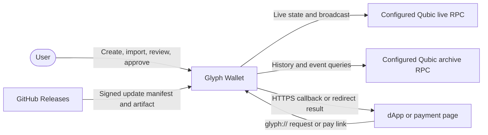

<div align="center">


# Glyph

**A self-custodial desktop wallet for Qubic**

Manage accounts, move QU, use Qubic contracts, and review dApp requests from a compact native desktop application.

[](https://github.com/glyphq/wallet/releases/latest)
[](https://github.com/glyphq/wallet/actions/workflows/ci.yml)
[](./LICENSE)
[](./SECURITY.md)

Windows x64 · macOS Universal · Linux x86_64

[**Download Glyph**](https://github.com/glyphq/wallet/releases/latest) · [Security](./SECURITY.md) · [Contributing](./CONTRIBUTING.md) · [Discord](https://discord.gg/s5qNRNGu96)

</div>

---

Glyph is designed around local control. Vaults and wallet metadata are encrypted on disk, transaction and message signing run in the native Rust layer, and the application talks directly to configured Qubic RPC endpoints. Glyph does not require a Glyph account, hosted key service, custody provider, or transaction relay.

Self-custody also means responsibility. Back up every seed and encrypted vault export, protect the vault password, verify every destination and dApp request, and install releases only from [`glyphq/wallet`](https://github.com/glyphq/wallet/releases).

## Download and install

Get the latest stable release from the [GitHub Releases page](https://github.com/glyphq/wallet/releases/latest).

This README describes the current source tree. A stable download can lag behind unreleased branch work, so check the release notes and [`CHANGELOG.md`](./CHANGELOG.md) when comparing a binary with the repository.

| Platform | Recommended download | Installation | Updates |
|---|---|---|---|
| Windows x64 | `Glyph_*_x64-setup.exe` | Run the per-user NSIS installer | Built-in signed updater |
| macOS, Apple Silicon and Intel | `Glyph_*_universal.dmg` | Open the DMG and move Glyph to Applications | Built-in signed updater |
| Linux x86_64, portable | `Glyph_*_amd64.AppImage` | Make executable, then run | Built-in signed updater |
| Debian / Ubuntu x86_64 | `Glyph_*_amd64.deb` | `sudo apt install ./Glyph_*_amd64.deb` | System package workflow |
| Fedora / RHEL-compatible x86_64 | `Glyph-*.x86_64.rpm` | `sudo dnf install ./Glyph-*.x86_64.rpm` | System package workflow |

For an AppImage:

```sh
chmod +x Glyph_*_amd64.AppImage
./Glyph_*_amd64.AppImage
```

Each release includes platform-specific `SHA256SUMS-*.txt` files. Compare the checksum of the downloaded installer before opening it. Stable Windows and macOS publication is also gated on native signing and, for macOS, notarization.

> [!IMPORTANT]
> Linux AppImage installations can update in place. Linux `.deb` and `.rpm` installations do not use Glyph's built-in updater and should be replaced through the same package workflow used to install them.

## What Glyph includes

### Wallets and accounts

- Create a new seeded vault or import an existing 55-character Qubic seed.
- Maintain multiple encrypted vaults with custom names, colors, and icons.
- Add, import, rename, hide, and reveal accounts within a vault.
- Manage up to 16 accounts per vault.
- Export and import password-protected Glyph vault backups in a signed JSON envelope.
- Switch between accounts and vaults without leaving the application shell.
- View QU balances, approximate USD values, 24-hour price movement, and owned asset balances.
- Hide balance values when working in public or shared environments.

### Send, receive, and Qubic contracts

- Send QU with destination validation, contact matching, recent-recipient suggestions, review, native signing, and pending confirmation tracking.
- Receive through an account identity, QR code, or copy action.
- Generate shareable web and `glyph://pay` payment links with an optional amount and label.
- Use **Send Many** for up to 25 recipients, including CSV, plaintext, and JSON import.
- Burn QU through the QUtil contract with an irreversible-action warning and optional password confirmation.
- Lock and unlock QEarn positions, inspect epoch information, and review existing positions.
- Save recurring transfer templates with an interval, due state, pause control, and explicit **Send now** action. Glyph does not automatically sign or broadcast scheduled transfers in the background.
- Track broadcast transactions until they confirm, fail, or expire at their target tick.

### History, contacts, and wallet intelligence

- Browse paginated transaction and contract activity from the configured Qubic archive RPC.
- Filter history by direction, transaction type, amount, date, or tick range.
- Group activity by date or counterparty.
- Add local transaction memos and export memo data as JSON.
- Preserve local QU/USD price snapshots for historical fiat estimates.
- Review vault analytics including net flow, incoming and outgoing volume, average transaction size, monthly summaries, top counterparties, contract usage, and a 12-week activity view.
- Search across vaults, accounts, identities, notes, tags, contacts, transaction hashes, memos, and known contracts.
- Maintain a contact book with names, identities, notes, tags, recent-use ordering, and direct send actions.

### Desktop experience

- Compact portrait desktop shell built with Tauri v2.
- System tray with open, quit, and optional hide-on-close behavior. The main window continues to work when a Linux desktop does not expose a tray host.
- Desktop notifications for received QU, broadcasts, confirmations, failed or expired transactions, with an option to suppress notifications while locked.
- Dark and light themes plus selectable font pairs.
- Configurable HTTPS live and archive RPC endpoints plus target-tick offset.
- Built-in updater for Windows, macOS, and Linux AppImage installations.
- Local security audit log for unlock attempts, seed reveal, vault exports, and dApp request activity.
- Diagnostics for network health, sync distance, updater state, runtime issues, storage use, CSP mode, and a downloadable debug bundle.

### dApp requests

Glyph registers the `glyph://` desktop protocol and supports five request types:

| Request | Purpose |
|---|---|
| `connect` | Request a permission set and optional account scope |
| `transfer` | Ask the user to review and sign a QU transfer |
| `sc_call` | Ask the user to review and sign a smart-contract call |
| `sign_message` | Ask the user to sign a bounded message |
| `verify_message` | Verify a message signature without signing |

The wallet provides:

- a dedicated review screen before approval or rejection
- remembered permissions for transfers, contract calls, and message signing
- optional permission scoping to specific account identities
- permission revocation from Settings
- one-hour nonce replay protection persisted by the native layer
- delivery through an HTTPS callback POST or browser redirect
- local request history and delivery status feedback

A request uses this route:

```text
glyph://v1/request?d=<base64url-envelope>
```

A payment link uses this route:

```text
glyph://pay?to=<identity>&amount=<optional-qu>&label=<optional-label>
```

> [!CAUTION]
> A custom-protocol request can claim a dApp name and HTTPS origin, but the operating system protocol launch does not cryptographically prove which website initiated it. Glyph labels that identity as unverified. Users must review the claimed origin and requested action themselves.

## How Glyph fits into the Qubic ecosystem

Glyph is the local desktop trust boundary between a user, Qubic infrastructure, and applications requesting approval.


```mermaid
flowchart LR
    User([User]) -->|Create, import, review, approve| Glyph[Glyph Wallet]
    Glyph -->|Live state and broadcast| Live[Configured Qubic live RPC]
    Glyph -->|History and event queries| Archive[Configured Qubic archive RPC]
    DApp[dApp or payment page] -->|glyph:// request or pay link| Glyph
    Glyph -->|HTTPS callback or redirect result| DApp
    Releases[GitHub Releases] -->|Signed update manifest and artifact| Glyph
```

- **This repository is the wallet client.** It contains the React interface, native Rust commands, protocol handler, packaging, and release automation.
- **Qubic connectivity is direct.** The default live and archive endpoints are `https://rpc.qubic.org/live/v1` and `https://rpc.qubic.org/query/v1`. Users can replace both with other HTTPS endpoints.
- **Shared Qubic libraries provide protocol types and clients.** The frontend uses the `@qubic.org` wallet, crypto, transaction, RPC, contract, event, and type packages.
- **dApps integrate through an explicit approval protocol.** Requests enter through `glyph://`, remain queued until the wallet can display them, and never bypass the user review flow.
- **Glyph does not provide cloud recovery.** Vault passwords, seeds, contacts, memos, dApp permissions, and other wallet state are not recoverable from a Glyph account or server.

## Security and trust model

Security claims in this section describe the current implementation on this branch. They are not a guarantee against malware, operating-system compromise, social engineering, malicious dependencies, or undiscovered vulnerabilities.

### Local data protection

| Boundary | Current implementation |
|---|---|
| Vault encryption | AES-256-GCM in Rust |
| Password derivation | PBKDF2-HMAC-SHA256 with 600,000 iterations for new vaults |
| Vault salt and nonce | Random 32-byte salt and 12-byte GCM nonce |
| Wallet metadata | Encrypted before the Tauri store writes it to disk |
| Unlocked native session | Seeds retained in zeroizing native memory and cleared by native lock paths |
| Transaction signing | Narrow native `sign_transaction` command |
| Message signing | Bounded native `sign_message` command |
| Clipboard | Native timed clear with immediate pending-copy wipe on lock |
| Renderer permissions | Explicit Tauri capability allowlist scoped to the main window |
| Packaged webview | CSP blocks remote scripts, inline scripts, and `eval` |

The vault payload, contacts, settings, memos, request history, audit events, and other persisted wallet state stay on the local device. Glyph does not upload seeds or vault passwords to a Glyph-operated service.

### Locking and sensitive operations

- Native idle and sleep detection clears the native session before notifying the renderer to lock.
- Optional window-blur locking follows the same native clear path.
- Auto-lock cannot be disabled through a zero timeout. The native policy constrains it to 1 minute through 24 hours.
- Password attempt and lockout state survive application hydration.
- Seed reveal requires the vault password unless a stronger supported policy is available.
- Password-backed biometric quick unlock and biometric seed reveal are currently disabled on every platform until credentials can be hardware-bound. Legacy stored credentials are removed after a successful password unlock.
- Signing requests are serialized and rate-limited. The current Qubic-compatible Rust FourQ implementation is variable-time, so it should not be described as constant-time.

### dApp and protocol hardening

- Windows and Linux protocol launches first pass through a small broker that accepts one bounded URL, allows only known routes and query keys, rejects unsafe command-line characters, and starts Glyph without a shell.
- Glyph independently validates the request again inside the wallet.
- Callback and redirect URLs must use credential-free HTTPS and match the request's claimed dApp origin.
- Native callback delivery rejects loopback, private, link-local, multicast, reserved, documentation, benchmarking, CGNAT, and IPv4-mapped private addresses.
- DNS results are validated and pinned into the callback HTTP client for the connection. Redirect following is disabled.
- Request messages, callback bodies, queues, and protocol URLs are bounded.

### Updates and release integrity

- Tauri updater artifacts are verified against the public key embedded in the application.
- Stable Windows releases require Authenticode credentials.
- Stable macOS releases require code signing and notarization credentials.
- Release workflows validate tag provenance, synchronized versions, artifact sets, updater signatures, and updater manifests before publishing a draft.
- Published releases are treated as immutable by the release automation.
- CI runs JavaScript and Rust checks plus dependency advisory audits. Approved inherited Linux GTK/Tauri warnings remain documented rather than hidden.

### Known boundaries

- Vault decryption runs in Rust, but the decrypted seeds currently pass through the trusted main WebView once during unlock for account derivation and native-session hydration. Signing does not retrieve seeds back from the native session.
- The Linux Tauri/WebKitGTK dependency graph currently inherits documented GTK3 maintenance and `glib` advisory warnings. See the audit report for scope and impact.
- Native packaging, Windows Authenticode validation, and macOS notarization are release-run validations rather than pull-request GUI tests.
- Repository branch protection, tag protection, and signing-key governance also depend on settings outside this source tree.

Read [`SECURITY_AUDIT.md`](./SECURITY_AUDIT.md) for the current review scope, fixes, validation evidence, and residual risks. To report a vulnerability, follow [`SECURITY.md`](./SECURITY.md) and do not open a public issue.

## Build locally

### Requirements

- [Bun](https://bun.sh/) 1.3.14
- [rustup](https://rustup.rs/) with the repository-pinned Rust 1.88.0 toolchain
- Platform WebView and native build dependencies from the [Tauri v2 prerequisites](https://v2.tauri.app/start/prerequisites/)
- `cargo-audit` 0.22.2 for the full security check

Use `cargo` and `rustc` from rustup, normally under `~/.cargo/bin`. An older distribution Rust package can bypass `rust-toolchain.toml` and fail the build.

On Ubuntu or Debian, the development build needs:

```sh
sudo apt update
sudo apt install build-essential libwebkit2gtk-4.1-dev libdbus-1-dev
```

Building Linux AppImage, `.deb`, and `.rpm` artifacts also needs:

```sh
sudo apt install libayatana-appindicator3-dev librsvg2-dev patchelf rpm xdg-utils
```

### Run locally

```sh
git clone https://github.com/glyphq/wallet.git
cd wallet
bun install --frozen-lockfile
bun tauri dev
```

### Create a production bundle

```sh
bun tauri build
```

Bundles are written below `src-tauri/target/release/bundle/`. Platform signing credentials are intentionally not part of the repository.

### Run the project checks

```sh
bun run check
bun run build
cargo check --manifest-path src-tauri/Cargo.toml --locked
cargo test --manifest-path src-tauri/Cargo.toml --locked
bun run release:check
cargo install cargo-audit --version 0.22.2 --locked
bun run audit:security
```

See [`CONTRIBUTING.md`](./CONTRIBUTING.md) before changing vault crypto, signing, Tauri capabilities, the `glyph://` handler, callback delivery, dependencies, or release workflows.

## Technology

| Layer | Implementation |
|---|---|
| Desktop shell | Tauri v2 |
| Frontend | React 19, TypeScript, Vite 7 |
| Routing | React Router 8 |
| State | Zustand 5 |
| Server state | TanStack Query 5 |
| Motion | Motion 12 |
| Styling | Tailwind CSS 4 plus project design tokens |
| Native core | Rust |
| Vault crypto | `aes-gcm`, `pbkdf2`, `sha2`, `zeroize` |
| Network | `@qubic.org/rpc` and native `reqwest` callbacks |
| Qubic integration | `@qubic.org/{wallet,crypto,tx,rpc,contracts,events,types}` |

## Documentation

| Document | Use it for |
|---|---|
| [`README.md`](./README.md) | Product overview, downloads, features, architecture, and local setup |
| [`docs/USER_GUIDE.md`](./docs/USER_GUIDE.md) | Installation, vaults, transfers, contracts, dApps, settings, and troubleshooting |
| [`docs/ARCHITECTURE.md`](./docs/ARCHITECTURE.md) | Runtime boundaries, state ownership, cryptography, IPC, networking, and platform integration |
| [`docs/DEVELOPMENT.md`](./docs/DEVELOPMENT.md) | Toolchains, local workflows, testing, packaging, and security-sensitive engineering rules |
| [`docs/RELEASING.md`](./docs/RELEASING.md) | Changesets, channels, tags, signing, artifact validation, and release recovery |
| [`SECURITY.md`](./SECURITY.md) | Supported versions and private vulnerability reporting |
| [`SECURITY_AUDIT.md`](./SECURITY_AUDIT.md) | Security review scope, remediations, validation, and residual risks |
| [`CONTRIBUTING.md`](./CONTRIBUTING.md) | Development prerequisites, required checks, and review expectations |
| [`DESIGN.md`](./DESIGN.md) | Product frame, design tokens, typography, components, and interaction rules |
| [`CHANGELOG.md`](./CHANGELOG.md) | Released features, fixes, and version history |
| [`LICENSE`](./LICENSE) | MIT license terms |

## Contributing and community

Glyph is free and open source. Issues and pull requests are welcome when they follow the security boundaries and validation requirements in [`CONTRIBUTING.md`](./CONTRIBUTING.md).

- [GitHub repository](https://github.com/glyphq/wallet)
- [Latest release](https://github.com/glyphq/wallet/releases/latest)
- [Discord community](https://discord.gg/s5qNRNGu96)
- [Private security report](https://github.com/glyphq/wallet/security/advisories/new)

## License

Glyph is available under the [MIT License](./LICENSE).
