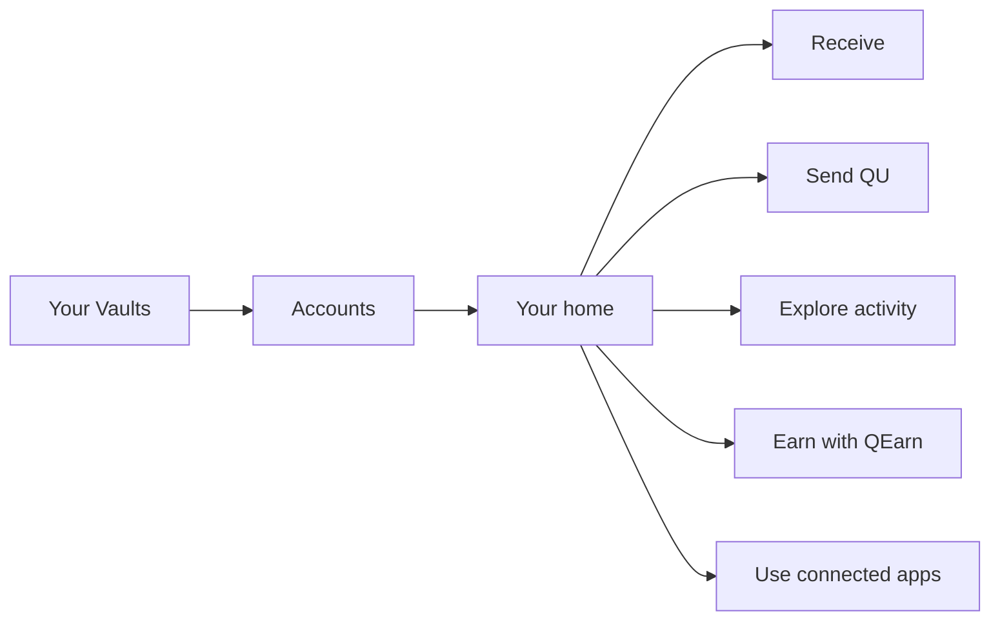
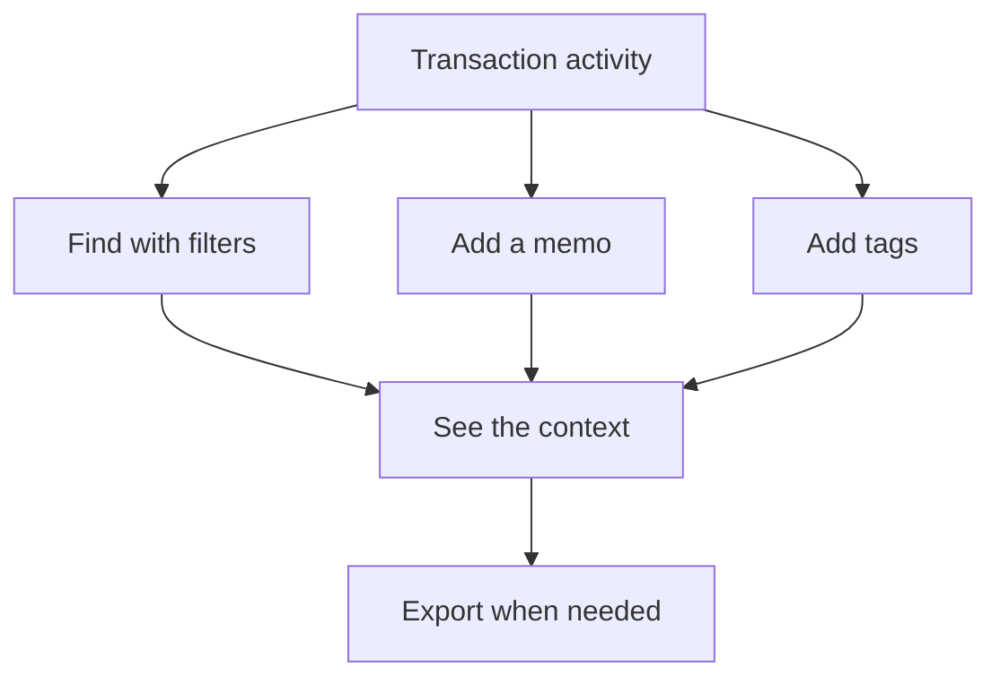
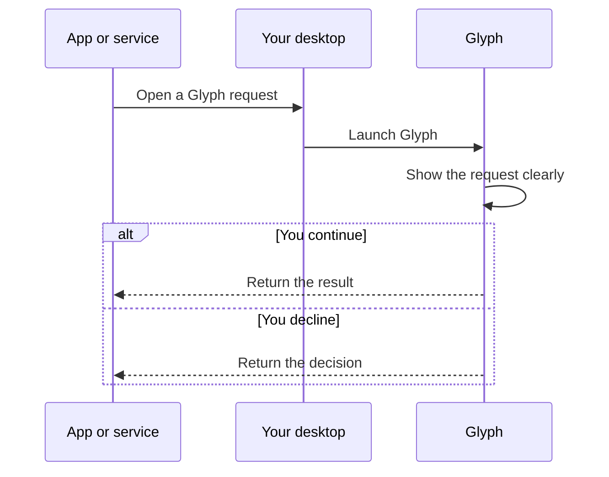

<div align="center">


# Glyph

### Your Qubic desktop, with room to breathe.

**Glyph is a self-custodial desktop wallet for Qubic.**
Create Vaults, shape your workspace, move QU, follow activity, and approve requests from the apps you use, all in one calm native app.

[](https://github.com/glyphq/wallet/releases/latest)
[](https://github.com/glyphq/wallet/actions/workflows/ci.yml)
[](./LICENSE)

Windows x64 · macOS Universal · Linux x86_64

[**Download Glyph**](https://github.com/glyphq/wallet/releases/latest) · [User guide](./docs/USER_GUIDE.md) · [Contributing](./CONTRIBUTING.md) · [Discord](https://discord.gg/s5qNRNGu96)

</div>

---

## One place, your pace

Glyph is built around the parts of Qubic you actually return to: your accounts, your activity, the people you pay, and the apps you choose to connect.


```mermaid
flowchart LR
    V[Your Vaults] --> A[Accounts]
    A --> H[Your home]
    H --> R[Receive]
    H --> S[Send QU]
    H --> E[Explore activity]
    H --> Q[Earn with QEarn]
    H --> D[Use connected apps]
```

### A good wallet should feel like yours

- **Make a home for every Qubic identity.** Create or import Vaults, keep multiple accounts together, and personalize them with names, colors, and icons.
- **Move without the mess.** Send QU, receive with a QR code or payment link, pay several people at once, and keep useful transfer templates close by.
- **See the story behind the balance.** Browse history, local memos, tags, contacts, analytics, counterparties, and activity trends without jumping between tools.
- **Take your setup with you.** Back up Vaults, organize your workspace, choose a theme and font, and make Glyph fit the way you work.

## A little tour

| When you want to… | Glyph gives you… |
| --- | --- |
| Start fresh | A new Vault, a guided backup, and room for up to 16 accounts per Vault |
| Get paid | Your Qubic identity, a QR code, and shareable payment links |
| Send QU | A clear review flow for one recipient or many |
| Keep context | Contacts, notes, tags, saved templates, and searchable history |
| Go deeper | QEarn positions, owned assets, contract activity, and Vault analytics |
| Stay in the flow | Notifications, diagnostics, updates, custom RPC settings, and focused shortcuts |

## For everyday Qubic

### Vaults, accounts, and a space that feels familiar

Create a Vault, import a Qubic seed, or restore a Glyph Vault export. Switch Vaults or accounts from anywhere in the app, then customize names, colors, icons, and display preferences as your setup grows.

Balances, owned assets, approximate fiat values, and recent activity stay close at hand. Need less visual noise? Hide balances, pick light or dark mode, or choose the interface font that feels right.

### Send, receive, and keep moving

- Send QU to an identity, a contact, or several recipients.
- Share an identity, QR code, or payment link when it is your turn to receive.
- Follow a transaction from broadcast to confirmation, expiry, or failure.
- Keep transfer templates for repeat payments.
- Explore QEarn positions, supported Qubic contracts, and owned assets from the same desktop home.

### Keep the details useful

Search and filter history by direction, type, amount, date, or tick range. Add local memos and tags, export activity when you need it, and use contacts to make recurring destinations easier to recognize.


```mermaid
flowchart TD
    T[Transaction activity] --> F[Find with filters]
    T --> M[Add a memo]
    T --> G[Add tags]
    F --> C[See the context]
    M --> C
    G --> C
    C --> X[Export when needed]
```

## Connected apps, still on your terms

Glyph opens Qubic payment links and `glyph://` requests from the apps and services you use. Connection, transfer, contract-call, signing, and verification requests arrive in Glyph for a clear review before you decide what happens next.


```mermaid
sequenceDiagram
    participant App as App or service
    participant Desktop as Your desktop
    participant Glyph as Glyph

    App->>Desktop: Open a Glyph request
    Desktop->>Glyph: Launch Glyph
    Glyph->>Glyph: Show the request clearly
    alt You continue
        Glyph-->>App: Return the result
    else You decline
        Glyph-->>App: Return the decision
    end
```

Manage connected apps and their permissions in **Settings → Connected apps**. For the complete request guide, see [External requests and Glyph links](./docs/USER_GUIDE.md#14-external-requests-and-glyph-links).

## Get started

1. Download Glyph from the [official releases page](https://github.com/glyphq/wallet/releases/latest).
2. Create a new Vault, import a Qubic seed, or restore a Glyph Vault export.
3. Back up the seed for every new Vault before continuing.
4. Fund an account, share its identity, or start exploring Qubic.

> **Small start, big picture.** Begin with one account and one action. Glyph will be ready when your setup grows.

## System requirements

Glyph is a native desktop application. Use a supported 64-bit desktop system with a graphical session and an internet connection to a Qubic RPC service. It does not run in a browser, on mobile, or on 32-bit systems.

| Resource | Practical baseline | Recommended |
| --- | --- | --- |
| Processor | 64-bit dual-core CPU | Modern 64-bit quad-core CPU |
| Memory available to Glyph | 512 MB | 1 GB when running alongside other desktop apps |
| Storage | 500 MB free space | 1 GB free space for updates, exports, and local activity data |

Glyph itself typically uses under 200 MB of memory at rest. The computer's total memory requirement is otherwise determined by its operating system and the apps you run alongside Glyph.

| Platform | Supported build | What you need to run it |
| --- | --- | --- |
| Windows | x64 | A current 64-bit Windows desktop. Run the per-user installer. |
| macOS | Universal | An Intel or Apple Silicon Mac. Move Glyph to Applications before opening it. |
| Linux | x86_64 | A 64-bit Linux desktop session. Choose the AppImage, Debian, or RPM package for your distribution. |

### Linux notes

- The AppImage, Debian, and RPM builds are all x86_64 only.
- AppImage uses the host graphics stack. Keep graphics drivers and the desktop compositor current if rendering is unstable.
- Desktop notifications need an active session notification service. The tray icon depends on AppIndicator support, which may require a desktop extension on GNOME.
- AppImage supports Glyph's built-in updater. Debian and RPM packages are updated through the system package manager.

## Download and install

Get the latest stable build from [GitHub Releases](https://github.com/glyphq/wallet/releases/latest).

| Platform | Download | Install |
| --- | --- | --- |
| Windows x64 | `Glyph_*_x64-setup.exe` | Run the per-user installer |
| macOS, Apple Silicon and Intel | `Glyph_*_universal.dmg` | Open the DMG and move Glyph to Applications |
| Linux x86_64 | `Glyph_*_amd64.AppImage` | Make it executable, then run it |
| Debian / Ubuntu x86_64 | `Glyph_*_amd64.deb` | `sudo apt install ./Glyph_*_amd64.deb` |
| Fedora / RHEL-compatible x86_64 | `Glyph-*.x86_64.rpm` | `sudo dnf install ./Glyph-*.x86_64.rpm` |

### Run the AppImage

```sh
chmod +x Glyph_*_amd64.AppImage
./Glyph_*_amd64.AppImage
```

AppImage installations support Glyph's in-app update path. Debian and RPM installations follow the usual system package update flow.

## Build from source

Glyph is made with React, TypeScript, Rust, and Tauri v2.

```sh
git clone https://github.com/glyphq/wallet.git
cd wallet
bun install --frozen-lockfile
bun tauri dev
```

Use Bun `1.3.14` and Rust `1.88.0`. Platform prerequisites, validation commands, and release guidance live in [CONTRIBUTING.md](./CONTRIBUTING.md).

## Keep exploring

- [User guide](./docs/USER_GUIDE.md)
- [Changelog](./CHANGELOG.md)
- [Contributing](./CONTRIBUTING.md)
- [Release notes](https://github.com/glyphq/wallet/releases)
- [Discord](https://discord.gg/s5qNRNGu96)

## License

[MIT](./LICENSE)
