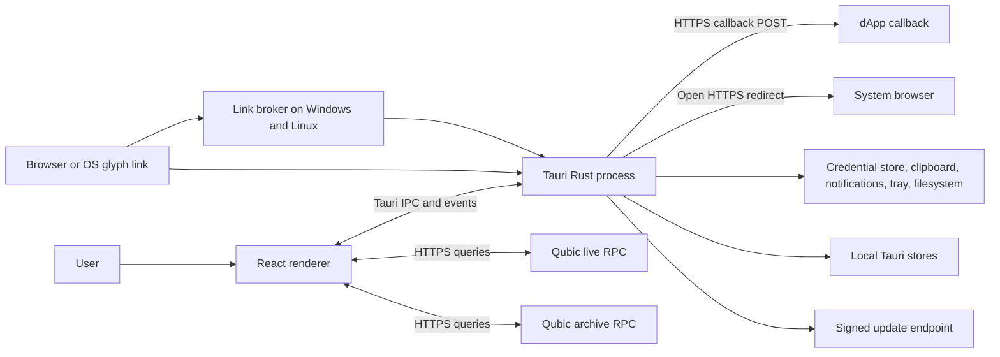
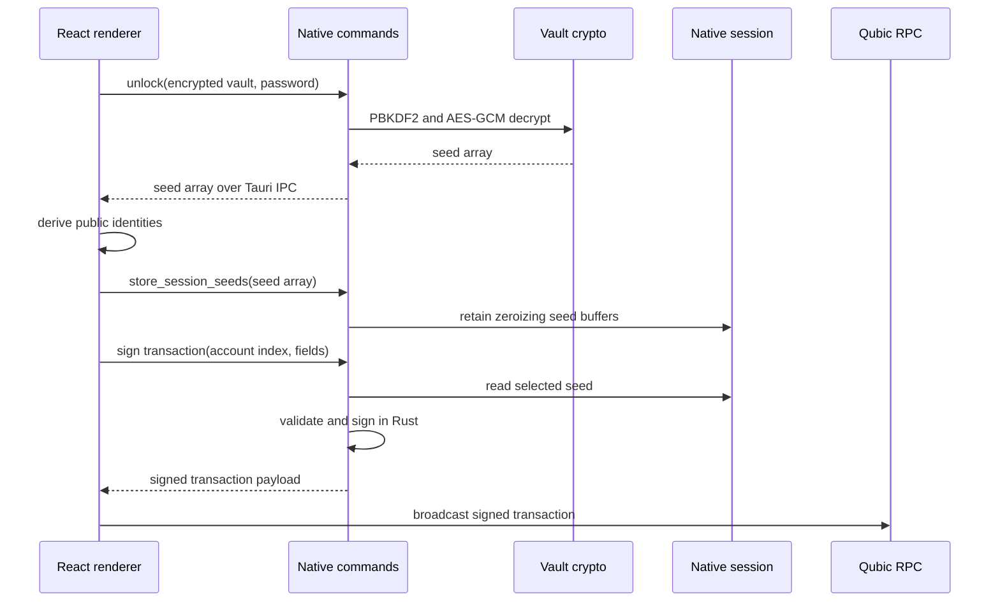

# Glyph Architecture

This document describes the current Glyph desktop-wallet implementation for engineers, maintainers, and security reviewers. It focuses on runtime boundaries, state ownership, cryptography, network flows, platform integration, and known limitations.

Glyph is a Tauri 2 desktop application. The user interface is a React and TypeScript renderer. Privileged operations, vault cryptography, active-session seed retention, Qubic signing, deep-link validation, secure-store encryption, auto-lock enforcement, and platform integration are implemented in Rust.

## 1. Design goals

The implementation is designed to:

- Provide a self-custody Qubic wallet without a Glyph-hosted seed or password service.
- Encrypt vault seeds with a user-supplied password.
- Encrypt persisted application metadata with an installation-specific key.
- Keep the long-lived unlocked signing session in native memory.
- Sign Qubic transactions and messages in native Rust.
- Require explicit UI review for transfers, smart-contract calls, and dApp requests.
- Limit Tauri capabilities to the main window and required desktop functions.
- Validate untrusted protocol links before they become wallet actions.
- Support signed application updates on supported package formats.

## 2. Explicit non-goals and limitations

The current design does not provide:

- Password reset, seed escrow, cloud recovery, or a Glyph user account
- Hardware-wallet integration
- Enabled biometric unlock or biometric seed reveal
- A browser extension or mobile runtime
- Automatic execution of scheduled transfers
- Silent dApp transaction approval based on a stored connection
- Deterministic zeroization of seed strings while they transiently exist in JavaScript
- Protection against malware with the same privileges as an unlocked desktop user
- Trustless balances, price data, or history when the configured RPC endpoints are malicious
- Automatic updates for Debian or RPM installations

## 3. Runtime topology



There is no Glyph application backend in the normal wallet data path. The renderer communicates with configured Qubic live and archive services. The native process communicates with operating-system facilities, the update service, and validated dApp callback destinations.

## 4. Repository structure

### Frontend

- `src/main.tsx`: renderer entry point
- `src/App.tsx`: application composition and startup behavior
- `src/router.tsx`: hash-based route tree
- `src/screens/`: feature screens for setup, vaults, sends, history, settings, requests, and support
- `src/layouts/`: application shell and animated route layouts
- `src/components/`: reusable UI and request-review components
- `src/hooks/`: RPC queries, polling, auto-lock integration, deep links, notifications, and updater hooks
- `src/lib/`: wallet domain logic, RPC clients, request validation, export format, session adapters, analytics, and formatting
- `src/store/`: persisted, session, updater, and UI state
- `src/styles/`: global application styles

### Native application

- `src-tauri/src/lib.rs`: Tauri builder, plugin setup, state registration, events, tray, single-instance behavior, and command registration
- `src-tauri/src/commands.rs`: command-facing validation and orchestration
- `src-tauri/src/vault_crypto.rs`: password-based vault encryption and decryption
- `src-tauri/src/store_crypto.rs`: installation-key management and persisted-value encryption
- `src-tauri/src/session_crypto.rs`: native unlocked-session seed storage
- `src-tauri/src/qubic_native.rs`: identity derivation, transaction construction, and native signing
- `src-tauri/src/auto_lock.rs`: native inactivity and sleep-lock state
- `src-tauri/src/clipboard.rs`: scheduled clipboard clearing
- `src-tauri/src/deep_link.rs`: request decoding, semantic validation, replay protection, callback delivery, and redirects
- `src-tauri/src/link_broker.rs`: public URL pre-validation shared by the broker and application
- `src-tauri/src/bin/glyph-link-broker.rs`: sidecar protocol-launch executable
- `src-tauri/src/biometric.rs`: platform scaffolding not exposed as an enabled feature

### Build and delivery

- `src-tauri/tauri.conf.json`: application, bundle, CSP, window, updater, and sidecar configuration
- `src-tauri/capabilities/default.json`: main-window Tauri capability policy
- `scripts/`: versioning, broker preparation, release validation, asset upload, and security audit scripts
- `.github/workflows/`: checks, versioning, release builds, and immutable asset publication

## 5. Frontend composition

The renderer uses:

- React 19
- TypeScript with strict checking
- Vite 7
- React Router 8 with a hash router
- Zustand 5 for application state
- TanStack Query 5 for network-derived state and caching
- Tailwind CSS 4 integration for styling

### Route classes

The route tree separates:

- Setup and import
- Lock and unlock
- Dashboard and vault management
- Standard send, Send Many, burn, staking, and scheduled templates
- Receive and payment-link creation
- History, transaction detail, analytics, and search
- Contacts
- External request review and request history
- Settings, security, audit, network, notifications, diagnostics, appearance, and support

The animated application layout mounts cross-cutting hooks, including auto-lock behavior, around authenticated routes.

### Startup sequence

The splash flow waits for persisted Zustand hydration before choosing the initial route. It enforces a minimum splash duration of approximately 4.8 seconds and exposes a stalled-hydration state after approximately 8 seconds.

The route decision is:

1. No configured vault: setup.
2. Vault configured but no active session: lock.
3. Active unlocked session: dashboard.

The updater check is triggered once during startup.

## 6. State ownership

Glyph divides state according to lifetime and sensitivity.

### Persisted Zustand state

Persisted state includes encrypted vault records and local metadata such as:

- Vault descriptors and account metadata
- Contacts
- Pending transaction summaries
- Transaction memos
- Scheduled-transfer templates
- Notification and audit history
- Request history and approved dApps
- Price samples and runtime issues
- Application, network, security, and appearance settings

The persisted boundary sanitizes and caps collections before storage. Current important caps are:

| Record | Maximum retained |
| --- | ---: |
| Accounts in one vault | 16 |
| Pending transactions | 50 |
| Transaction memos | 500 |
| Scheduled templates | 50 |
| Notifications | 200 |
| Audit events | 500 |
| External request history | 200 |
| Price snapshots | 2,000 |
| Runtime issues | 100 |

### Session state

Session state represents the currently selected vault and non-durable UI workflow state. It includes:

- Lock status
- Derived public account identities and display state
- Current selections
- Volatile send drafts and alerts
- Queued request presentation state

The renderer retains cached public identities when locked so it can continue limited balance polling and notification reconciliation. Identities are public account identifiers, not seeds.

### Native session state

The Rust process owns the long-lived active seed array after unlock. Seeds are stored as zeroizing byte buffers. Native commands reference accounts by index for identity derivation and signing.

Lock clears this native state synchronously before a `glyph:lock` event tells the renderer to clear its unlocked state.

### TanStack Query state

Network-derived balances, tick data, owned assets, transaction history, and related RPC results live in the query cache. Query keys include the relevant RPC endpoint identity so changing endpoints does not reuse data from another configured service.

## 7. Persistent storage architecture

Glyph uses Tauri Store files under the platform application-data location.

### Main application store

The logical application state is stored in `glyph.json`. Values written through Glyph's secure storage adapter use this format:

```text
enc-v1:<base64url(nonce || AES-GCM ciphertext-and-tag)>
```

Encryption properties:

- AES-256-GCM
- Random nonce for each stored value
- One random 256-bit installation key
- Authenticated decryption before JSON deserialization

Older plaintext values are accepted for migration. When the application next saves state, they are rewritten in encrypted form.

### Installation key storage

The store key is cached in the native process after loading or creation.

| Platform | Preferred storage | Fallback or durable copy |
| --- | --- | --- |
| Windows | Windows Credential Manager generic credential | `%APPDATA%/com.qubic.glyph/store-key` |
| macOS | System keyring and Keychain | User data directory file |
| Linux | Secret Service through the system keyring | `~/.local/share/com.qubic.glyph/store-key`, or the XDG equivalent |

On Unix, the local key directory is created with mode `0700` and the key file with mode `0600`. On Linux, the implementation deliberately writes a durable local copy even if Secret Service storage succeeds. On Windows, the fallback file relies on the user's application-data access controls rather than an explicit file ACL configured by Glyph.

This key protects local data at rest but is available to the running application. An attacker who can execute as the same desktop user can potentially access both ciphertext and key material.

### Deep-link replay store

`glyph-security.json` stores accepted request nonces and timestamps. Nonces are not secret. They are retained to enforce the one-hour replay window.

### Export integrity key

Version 2 vault exports include HMAC-SHA256 over a canonical envelope. The HMAC key is installation-local and persisted through Glyph's protected storage path.

Consequences:

- The originating installation can detect a modified export.
- A different installation cannot verify that local HMAC and imports with an unverified-integrity warning.
- The HMAC is not a portable digital signature, identity proof, or substitute for vault encryption.
- Legacy unsigned exports are intentionally accepted for compatibility.

## 8. Vault cryptography

### Encryption format

New vault encryption uses:

- AES-256-GCM
- PBKDF2-HMAC-SHA256
- 600,000 iterations
- Random 32-byte salt
- Random 12-byte GCM nonce
- Vault format version 1

The password-derived AES key exists in native code for the encryption or decryption operation and is then dropped. Sensitive Rust buffers use zeroizing containers where practical.

### Compatibility validation

Decryption validates input sizes and resource bounds before deriving a key. It accepts compatible 16-byte or 32-byte salts and PBKDF2 iteration counts from 100,000 through 2,000,000. This supports older data while preventing an imported file from requesting an unbounded derivation cost.

### Password policy location

Password strength rules are UI policy, not cryptographic-format constraints:

- New-vault setup requires at least 10 characters and the screen's minimum strength level.
- The current password-rotation screen accepts at least 8 characters.

The native vault format can decrypt any valid password bytes. Reviewers should not assume one consistent password rule across every UI path.

## 9. Unlock and signing data flow



### Security interpretation

The architecture reduces seed residence in the renderer after unlock, but it is not a strict native-only secret architecture.

Seeds transiently enter renderer memory during:

- New-account creation
- Vault import and unlock
- Account addition or removal workflows that re-encrypt the vault
- Explicit seed reveal

They cross Tauri IPC as serialized command values. JavaScript strings and objects cannot be reliably overwritten. The native session is the long-lived signing location, but the renderer remains inside the sensitive trust boundary whenever a vault is being manipulated or unlocked.

A compromised renderer in an unlocked session can invoke allowed signing commands with attacker-selected transaction fields. Native validation prevents malformed structures and some abuse, but the review UI is the primary intent-confirmation control.

## 10. Native signing

`qubic_native.rs` implements Qubic identity derivation and signing through the Qubic Rust libraries.

Native commands validate, as applicable:

- Account index exists in the native session
- Recipient identity syntax and checksum
- Signed 64-bit amount parsing and nonnegative constraints
- Target tick is in the future
- Contract and input parameters
- Transaction input payload is no more than 1,024 bytes
- Message input is no more than 64 KiB at the native command boundary

All native transaction and message signing shares a process-level rate limiter of one operation per 750 milliseconds.

The external-request URL envelope imposes smaller practical limits. For example, sign-message request text is limited to 2,048 characters and the encoded request payload is limited to 8,192 base64url characters.

## 11. Locking and session lifecycle

### Native auto-lock

The native auto-lock controller tracks activity and enforces a timeout between 1 and 1,440 minutes. The UI exposes 1, 5, 15, 30, and 60 minutes, with 15 minutes as the default.

Renderer activity events include mouse movement, keyboard input, click, wheel, and touch movement. The auto-lock loop evaluates state every 10 seconds.

### Sleep and blur

Lock-on-sleep is enabled by default. The implementation treats a wall-clock jump greater than 12 seconds as a likely suspend or sleep event.

Lock-on-window-blur is disabled by default. When enabled, it forces a native lock in packaged builds. It is intentionally bypassed during development to avoid locking whenever developer tools or another window gains focus.

### Lock ordering

The native force-lock path:

1. Clears native session seeds.
2. Updates native lock state.
3. Emits `glyph:lock`.
4. Lets the renderer clear unlocked wallets, drafts, and alerts.

This ordering avoids an event window in which the renderer appears locked while native signing secrets remain available.

### Process exit

Normal process termination drops in-memory native session state. The explicit lock path is stronger because it clears the session before the process continues running.

## 12. Clipboard boundary

Clipboard writes are performed through Tauri clipboard integration. Native scheduling tracks whether Glyph has a pending clear operation.

- Identity copies use a configurable 15, 30, or 60 second timeout, or no automatic clear.
- The default is 30 seconds.
- Seed copies use 60 seconds.
- Application close attempts to clear when a Glyph clipboard clear is pending.

The clear operation overwrites the entire clipboard. It does not compare the current clipboard value to the value originally copied by Glyph. A user copying different content before the timer expires can have that newer content cleared.

## 13. RPC and transaction architecture

### Network clients

The frontend owns live and archive RPC clients. Custom endpoints must use HTTPS and can be tested in Network settings before being persisted.

The live RPC supplies current network state and accepts signed transaction broadcasts. The archive RPC supplies paginated history and related indexed data.

### Query and polling profiles

Default polling intervals depend on application visibility and lock state:

| State | Default polling interval |
| --- | ---: |
| Active window | 5 seconds |
| Background window | 10 seconds |
| Hidden to tray | 15 seconds |
| Locked | 20 seconds |

Persisted values are sanitized to a range of 2 through 60 seconds. Owned-asset queries enforce a minimum 30-second refresh interval.

### Standard transfer flow

1. The renderer validates source, recipient, amount, balance, and pending-transaction guard.
2. It fetches the current tick and adds the configured offset, default 10.
3. Native Rust constructs and signs the transaction.
4. The renderer broadcasts it to the live RPC.
5. A local pending record is retained.
6. Archive and event queries reconcile it to confirmed, failed, or expired.

Only one outgoing pending operation is allowed per source identity. This is an application-level guard, not a Qubic protocol lock.

### History composition

History merges:

- Paginated archive transactions, 50 per page
- Recent event-log results for the initial time window
- Local pending records

The frontend deduplicates merged results. Event supplementation mainly covers approximately two weeks of recent activity. Archive indexing delays can still produce temporary gaps.

### Local transaction metadata

Memos are local records keyed to transactions and are not included in a standard on-chain transfer. Historical fiat values use the nearest retained local price sample. Neither should be treated as authoritative network data.

## 14. Smart-contract feature boundaries

### Send Many

Send Many uses the QUtil `SendToMany` V1 contract:

- Up to 25 validated recipients
- One smart-contract transaction
- Contract fee fetched before review
- Balance check includes recipient total and fee

CSV and JSON import is parsed in the renderer. Invalid rows are filtered and no more than 25 valid entries are retained, so review must not assume an import error is always fatal.

### Burn

Burn invokes the QUtil `BurnQubic` contract. It is irreversible. An optional application setting can require vault-password revalidation before signing.

### QEarn

QEarn lock and unlock use smart-contract transactions. The UI enforces a minimum lock amount of 10,000,000 QU and presents the 52-epoch lock period and early-unlock reward caveat. Position data is queried in bounded epoch batches.

### Scheduled transfers

Scheduled transfers are persisted templates only. There is no timer service, native executor, automatic signing, or automatic advancement of `nextRunAt`. The manual action routes to the standard send screen.

## 15. Deep links and dApp requests

### Public protocol surface

The accepted public routes are:

```text
glyph://pay?to=<identity>&amount=<optional>&label=<optional>
glyph://v1/request?d=<base64url-json>&cb=<optional>
```

The request route accepts only `d` and optional `cb` parameters. The pay route accepts only `to`, optional `amount`, and optional `label`.

### Broker boundary

On Windows and Linux, protocol registration invokes the bundled `glyph-link-broker` sidecar rather than passing arbitrary command-line input directly to the main executable.

The broker:

- Accepts exactly one URL argument
- Limits it to 12 KiB
- Rejects control characters, whitespace, quotes, apostrophes, backslashes, and pipe characters
- Rejects duplicate, empty, unknown, or malformed parameters
- Accepts only the two public routes
- Starts a fixed wallet executable next to the broker
- Does not invoke a shell

This is syntactic containment. The main application independently repeats route parsing and performs semantic validation.

### Single-instance behavior

The main application accepts no launch argument or one valid Glyph URL. Subsequent valid protocol launches are forwarded to the existing application instance. Invalid extra arguments are not treated as requests and do not open a new request surface.

### Request envelope

The `d` value is base64url-encoded JSON with a maximum encoded size of 8,192 characters. The native parser accepts either a normalized envelope or a compatible bare request and emits the normalized form to the renderer.

Supported types are:

- `transfer`
- `sc_call`
- `sign_message`
- `verify_message`
- `connect`

### Validation

Native validation includes:

- Nonce length 16 through 128 using a restricted character set
- One-hour nonce replay retention
- Expiry no more than one hour ahead
- HTTPS dApp origin without credentials
- HTTPS callback and redirect URLs
- Callback and redirect origin equality with the dApp origin
- Rejection of loopback, private, link-local, multicast, documentation, and other non-global destinations
- DNS resolution with every resolved address required to be globally routable
- Identity and amount rules per request type
- Message and contract payload bounds

A missing expiry is accepted for validation using an effective five-minute lifetime, but the normalized renderer request does not gain a synthesized `exp` field. As a result, the review UI cannot display a countdown for that compatibility case.

There is a current cross-layer contract-index mismatch: renderer schema validation allows a wider smart-contract range, while native validation accepts only contract indexes 0 through 63. Native validation is authoritative, so some renderer-accepted inputs are rejected before execution.

### Queues and replay timing

Pending dApp requests and payment links each use a bounded queue of 16. The oldest item is dropped when a queue is full.

The native layer records a request nonce when the request is accepted for review, before approval. Rejecting or closing the request therefore prevents retry with the same nonce during the one-hour replay window.

Requests received while locked remain queued and are presented after unlock.

### Approval semantics

Every transfer, contract call, and message-sign request requires explicit review. A `connect` approval stores an origin, selected account scopes, and selected permissions. Those records support connection management and display. They do not create a transport session or authorize future silent operations.

### Result delivery

Approved request results can be:

- POSTed as JSON to a callback
- Encoded into a redirect URL opened in the system browser
- Copied by the user

Callback hardening includes:

- Same-origin validation at ingestion and delivery
- HTTPS only
- All DNS results checked for global routability
- Connection pinned to a validated address
- Redirect following disabled
- 10-second timeout
- 4 KiB maximum response body

Delivery failure is recorded and the UI can retry, save, or copy the result.

## 16. Notifications and background behavior

The native layer integrates operating-system notifications and tray behavior. The frontend determines notification events from balances, history, and pending-state transitions.

- Desktop notifications are off by default.
- The first delivery requests system permission.
- Notification records are capped at 200.
- Locked-state desktop display follows the user's privacy setting, but events can still be persisted.
- Startup reconciliation can examine up to 24 hours of received activity without replaying old desktop popups.

If hide-to-tray is enabled, a close request hides the main window. Otherwise, it exits. Tray construction failure is nonfatal.

## 17. Updater and packaging

Tauri updater configuration embeds a public verification key and points to release `latest.json` metadata. The application checks once at startup.

Integrated updater behavior is supported for:

- Windows NSIS
- macOS application bundles
- Linux AppImage

Debian and RPM packages are system-managed and require package replacement rather than the Tauri update installer.

The Windows updater uses quiet installation. Linux AppImage update handling adjusts temporary-directory behavior so the replacement package remains on a suitable filesystem.

## 18. Tauri capability and web security policy

### Window

The main window is constrained to a desktop-wallet form factor:

- Initial size: 380 by 680
- Minimum: 360 by 640
- Maximum: 420 by 760
- Decorations disabled
- Packaged developer tools disabled
- Maximize and fullscreen not enabled by default

### Content Security Policy

The packaged CSP permits:

- Default content from `self`
- Scripts from `self`
- Styles from `self` with inline styles allowed
- Fonts from `self` and `data:`
- Images from `self`, `data:`, and `blob:`
- Connections to `self`, Tauri IPC endpoints, and HTTPS

Remote scripts are not permitted by the configured CSP. The HTTPS connection allowance is broad because users can configure RPC endpoints and dApp callbacks are native.

### Main-window capabilities

The main window receives only the declared Tauri capabilities, including:

- Basic window close, minimize, drag, maximize toggle, and fullscreen operations
- External opener
- Store get, set, load, save, and delete
- Deep-link handling
- Clipboard write
- Notifications
- Updater check and install
- Save dialog
- File existence and write access scoped to Downloads and Documents

Native application code can access its private application directories independently of renderer filesystem capabilities.

A renderer compromise can exercise these allowed APIs and registered native commands. Capability restriction reduces ambient desktop access but does not make an unlocked compromised renderer safe for wallet signing.

## 19. Platform-specific native behavior

### Windows

- Installation key prefers Windows Credential Manager.
- NSIS uses per-user installation.
- Installer hooks register protocol handling through the broker.
- A data-file key fallback exists if Credential Manager operations fail.

### macOS

- Builds are universal across Apple Silicon and Intel.
- The installation key prefers Keychain through the keyring API.
- Tauri handles the custom URL scheme integration.
- Biometric platform code exists but public commands remain disabled.

### Linux

- Packages include AppImage, Debian, and RPM.
- Protocol integration uses the broker for desktop launches.
- The installation key can use Secret Service and also has a durable mode-`0600` file copy.
- Tray availability depends on AppIndicator desktop support.
- WSLg detection disables WebKit compositing and DMABUF.
- AppImage bundles WebKitGTK and GTK components but depends on host GL and EGL behavior.

## 20. Threat model and trust boundaries

### Protected against

The implementation provides meaningful controls against:

- Offline inspection of vault ciphertext without the password
- Offline inspection of normal application-store values without the installation key
- Accidental or local modification of an export when verified on its originating installation
- Replayed dApp links within the nonce retention window
- Basic command-line and shell injection through registered protocol links
- Private-network callback targeting and common DNS rebinding paths
- Remote script loading under the packaged CSP
- Unbounded signing calls and oversized native payloads
- Continued native signing after an explicit lock event

### Not protected against

The design does not protect secrets or transaction intent from:

- Malware or an attacker running as the same unlocked operating-system user
- A compromised renderer during an unlocked session
- Screen capture, accessibility capture, or malicious input methods during seed reveal
- Clipboard managers retaining copied values
- A user approving a deceptive but structurally valid request
- A malicious RPC lying about balances, prices, ticks, history, or broadcast success
- Loss of all seeds, exports, and passwords
- Rollback or replacement of the entire local installation by an attacker with sufficient system privileges

### Trust assumptions

Security depends on:

- The integrity of the installed Glyph binary and bundled assets
- Tauri, WebView, Rust, npm, and Qubic dependency integrity
- Operating-system user isolation and credential-store behavior
- The user's ability to review transaction details
- At least one trustworthy source for network verification
- Secure release signing and update-key custody

## 21. Known implementation caveats

Security and architecture reviews should explicitly account for these current behaviors:

1. **Transient renderer seed exposure:** unlock returns seeds over IPC before the native session is populated.
2. **Biometrics disabled:** all public biometric commands return unavailable or an error.
3. **Potential seed-reveal configuration trap:** the persisted require-biometric setting can be enabled even though enrollment is disabled.
4. **Inconsistent password minimums:** onboarding requires 10 characters while password rotation requires 8.
5. **Clipboard ownership is not checked:** a scheduled clear can erase newer clipboard content.
6. **Linux store key has a durable file copy:** Secret Service success does not eliminate the local key file.
7. **Windows fallback ACL is implicit:** the fallback key file does not receive an explicitly configured Glyph ACL.
8. **Scheduled transfers are not executed:** they are reminders and prefill templates.
9. **Stored dApp permissions are not silent authorization:** every action still requires review.
10. **Nonce consumption occurs before approval:** rejected requests cannot reuse the same nonce for one hour.
11. **Missing request expiry is not surfaced to the renderer:** native validation applies a five-minute effective lifetime without adding the field.
12. **Smart-contract index validation differs by layer:** native validation is narrower and authoritative.
13. **Audit history is mutable:** it is local, capped, and clearable.
14. **Diagnostics contain metadata:** reports omit vault secrets but can disclose identities in scopes, origins, endpoints, and recent security activity.
15. **Network-derived data is trusted for display:** signatures remain local, but malicious RPC data can influence user decisions.

## 22. Review checklist for sensitive changes

Changes involving vaults, signing, deep links, persistence, or platform integration should verify:

1. What process and state layer owns each secret at every step.
2. Whether a value crosses Tauri IPC or enters JavaScript.
3. Whether native commands treat renderer arguments as untrusted.
4. Whether lock clears native state before UI state changes.
5. Whether persisted collections remain sanitized and bounded.
6. Whether new stores use encrypted-value handling where appropriate.
7. Whether URL validation covers parsing, scheme, credentials, origin, DNS, redirects, sizes, and replay.
8. Whether callback delivery revalidates instead of trusting ingestion-time checks alone.
9. Whether a new Tauri capability is scoped only to the required window and path.
10. Whether a platform package has the same behavior as development mode.
11. Whether release artifacts remain signed and immutable.
12. Whether documentation distinguishes local metadata from on-chain data.
